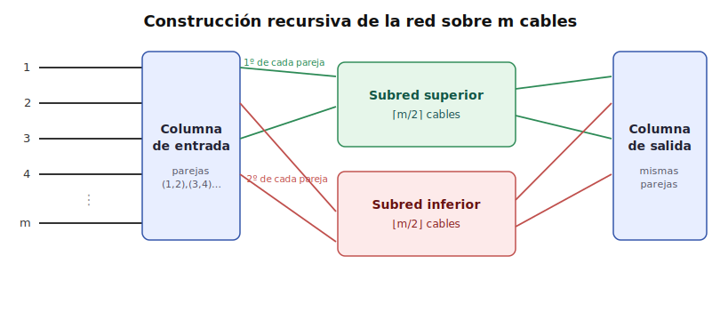
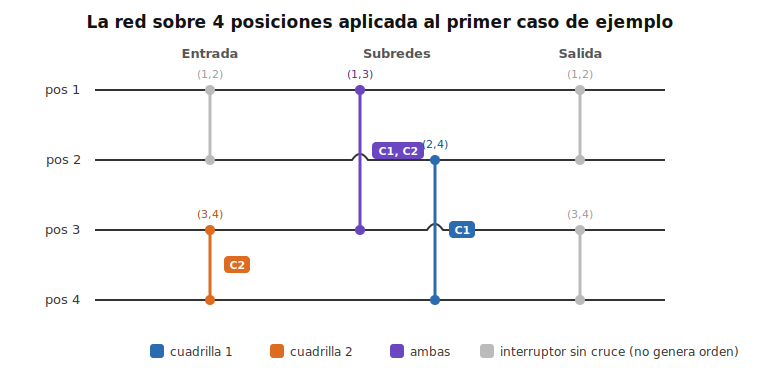

# Introducción a la solución

Hay $k$ cuadrillas, cada una con $n \le 200$ componentes formando una
permutación distinta de $1, \ldots, n$. Don Amaro canta órdenes: cada orden
fija dos posiciones $(a, b)$ de la fila y un subconjunto de cuadrillas; solo
esas cuadrillas intercambian a los componentes que ocupan esas dos posiciones.
Hay que construir una secuencia de **como mucho 2500 órdenes** que deje
ordenadas por altura a todas las cuadrillas a la vez.

# Reformulando: interruptores opcionales

Tenemos un presupuesto de $2500$ órdenes para $n \le 200$, es decir, unas
$12.5n$. Eso descarta las ideas más directas:

- Ordenar cada cuadrilla por su cuenta (por ciclos) cuesta hasta $n - 1$
  transposiciones por cuadrilla, pero son transposiciones *distintas* para
  cada una: hasta $k(n-1) \approx 40000$ órdenes. **No cabe.**
- Una red de burbuja (rondas de intercambios adyacentes, señalando en cada
  comparación solo a las cuadrillas desordenadas en ese par) es común a todas
  las cuadrillas, pero necesita $\sim n^2/2 = 20000$ comparadores. **No cabe.**

La clave está en mirar cada orden desde el punto de vista de una sola
cuadrilla: o le afecta (y aplica la transposición de posiciones $(a,b)$) o no
le afecta. Es decir, buscamos una **secuencia común de transposiciones
"opcionales"** tal que cada cuadrilla, activando el subconjunto que le
convenga, deshaga su propia permutación. Como conocemos las $k$ permutaciones
de antemano, podemos elegir con total libertad qué cuadrillas señala cada
orden.

Necesitamos algo del orden de $n \log n$, que podemos obtener mediante una
**red de Beneš**.

# La red de Beneš

Imagina $m$ *cables* horizontales paralelos, numerados de arriba abajo; por cada
cable entra un elemento por la izquierda y sale por la derecha. Un *interruptor*
une dos cables concretos en un punto concreto y tiene solo dos estados: o los
deja **rectos** (cada elemento sigue por su cable) o los **cruza** (los dos
elementos que llegan intercambian de cable). Una *red* es una colección de esos
interruptores colocados en sitios fijos: qué parejas de cables y en qué orden
está decidido de antemano y no cambia; lo único que elegimos, interruptor a
interruptor, es si lo dejamos recto o lo cruzamos.

Fijado ese esqueleto, cada forma de poner los interruptores (recto/cruzado)
manda cada elemento de su cable de entrada a *algún* cable de salida, es decir,
realiza una permutación. La propiedad útil de la red de Beneš es la
recíproca: para cualquier permutación que queramos (cada elemento de
entrada con su cable de salida prefijado) existe una elección de estados de los
interruptores que la realiza, llevando a la vez a todos los elementos a su
destino sin estorbarse.

Conviene distinguirla de una red de *ordenación* (como una red de burbuja): esa
mira los valores y decide sobre la marcha si intercambiar o no. La de Beneš no
compara nada; es una red de *encaminamiento*, y como nosotros ya conocemos la
permutación de antemano, podemos **calcular** qué interruptores hay que cruzar
para llevar cada elemento a donde toca.

El paralelismo con nuestro problema puede verse ya: los cables son las
posiciones de la fila, un interruptor sobre la pareja de posiciones $(a,b)$ es
una posible orden de don Amaro, y "cruzar" ese interruptor es aplicar el
intercambio. Así:

- La secuencia de órdenes es la lista de interruptores de la red, en orden.
- Cada cuadrilla encamina su propia permutación por la misma red, con sus
  propios cruces.
- La orden de un interruptor señala exactamente a las cuadrillas que se
  cruzan en él (y si no se cruza ninguna, la orden se omite).

## Construcción recursiva

La red sobre $m$ cables (para nosotros, $m$ posiciones concretas de la fila)
se construye así:

- Una **columna de entrada** con un interruptor en cada pareja de cables
  $(1,2), (3,4), \ldots$ Si $m$ es impar, el último cable queda sin pareja.
- Dos subredes recursivas: la **superior**, que recibe un cable de cada
  pareja (y el cable impar sobrante, si lo hay), y la **inferior**, que
  recibe el otro.
- Una **columna de salida** con interruptores en las mismas parejas: la
  salida $2j-1$ o $2j$ recoge un cable de la subred superior y otro de la
  inferior, y el interruptor decide cuál va a cuál.

El caso base es $m = 2$ (un único interruptor) y $m = 1$ (nada). En nuestra
implementación la subred superior vive en las posiciones de índice par y la
inferior en las de índice impar, de modo que cada interruptor siempre es una
transposición de dos posiciones reales de la fila.

*Figura 1: la red se define recursivamente. La columna de entrada empareja los
cables $(1,2), (3,4), \ldots$; de cada pareja, uno de sus cables va a la subred
superior y el otro a la inferior; cada subred es una red del mismo tipo pero más
pequeña; y la columna de salida vuelve a emparejar igual que la de entrada. Los
interruptores ocupan posiciones fijas: lo único que se decide en función de la
permutación es cuáles se cruzan.*

## El encaminamiento: un 2-coloreado

Para encaminar una permutación concreta hay que decidir a qué subred va cada
elemento. Las restricciones son dos:

- Los dos elementos de una **pareja de entrada** deben ir a subredes
  distintas (el interruptor manda uno arriba y otro abajo).
- Los dos elementos que desembocan en una misma **pareja de salida** deben
  venir de subredes distintas (la pareja de salida recoge un cable de cada
  subred).

Esto es un *2-coloreado* de un grafo cuyos vértices son los $m$ elementos y
cuyas aristas son "estos dos deben ir a subredes distintas". Cada vértice
tiene grado $\le 2$ (una arista por su pareja de entrada y otra por su pareja
de salida), así que el grafo es una unión de caminos y ciclos. Y todo ciclo
alterna aristas de entrada y de salida, luego tiene longitud **par** y el
coloreado siempre existe. Si $m$ es impar, el cable de entrada sin pareja y
el de salida sin pareja están cableados directamente a la subred superior,
lo que fuerza el color de sus elementos; se comprueba que ambos forzados son
los dos extremos de un mismo camino con paridad compatible, así que tampoco
hay conflicto. El resto de componentes se colorea empezando por donde se
quiera.

Fijado el coloreado, los cruces de las columnas de entrada y salida quedan
determinados, y cada subred recibe una permutación inducida a la que se
aplica el mismo procedimiento, recursivamente.

## Un ejemplo completo

Concretémoslo con el primer caso de la entrada de ejemplo: $n = 4$ posiciones y
dos cuadrillas,

- cuadrilla 1: $3, 4, 1, 2$ (en la posición 1 empieza el componente de altura 3,
  en la 2 el de altura 4, etc.),
- cuadrilla 2: $3, 2, 4, 1$.

La red sobre $4$ cables tiene seis interruptores en posiciones fijas: dos en la
columna de entrada, sobre las parejas $(1,2)$ y $(3,4)$; uno en cada subred, la
superior actúa sobre las posiciones $\{1,3\}$ y la inferior sobre $\{2,4\}$, y
cada una es una red de tamaño $2$, es decir, un único interruptor; y dos en la
columna de salida, otra vez sobre $(1,2)$ y $(3,4)$.

Encaminando cada cuadrilla por su cuenta con el 2-coloreado, resulta que a cada
una le bastan un par de cruces, y coinciden lo justo para reaprovecharse:

*Figura 2: los interruptores que cruza cada cuadrilla. Solo tres de los seis
interruptores tienen a alguien cruzándolos, así que solo se emiten tres órdenes;
los demás, aunque forman parte de la red, no generan ninguna orden.*

Cada interruptor con al menos una cuadrilla se convierte en una orden que señala
exactamente a esas cuadrillas:

| Orden | Interruptor | Posiciones | Cuadrillas |
| :---: | :---------- | :--------: | :--------: |
| 1 | entrada, pareja $(3,4)$ | 3 4 | {2} |
| 2 | subred superior | 1 3 | {1, 2} |
| 3 | subred inferior | 2 4 | {1} |

Ejecutadas en ese orden dejan formadas a las dos cuadrillas a la vez. En las
tablas siguientes, una casilla en **negrita** marca una posición que acaba de
cambiar porque el intercambio sí se le aplicó a esa cuadrilla:

Cuadrilla 1 (parte de $3, 4, 1, 2$):

| | pos 1 | pos 2 | pos 3 | pos 4 |
| :-- | :--: | :--: | :--: | :--: |
| inicio | 3 | 4 | 1 | 2 |
| tras orden 1 `3 4 {2}` (no le afecta) | 3 | 4 | 1 | 2 |
| tras orden 2 `1 3 {1,2}` | **1** | 4 | **3** | 2 |
| tras orden 3 `2 4 {1}` | 1 | **2** | 3 | **4** |

Cuadrilla 2 (parte de $3, 2, 4, 1$):

| | pos 1 | pos 2 | pos 3 | pos 4 |
| :-- | :--: | :--: | :--: | :--: |
| inicio | 3 | 2 | 4 | 1 |
| tras orden 1 `3 4 {2}` | 3 | 2 | **1** | **4** |
| tras orden 2 `1 3 {1,2}` | **1** | 2 | **3** | 4 |
| tras orden 3 `2 4 {1}` (no le afecta) | 1 | 2 | 3 | 4 |

Las dos terminan en $1, 2, 3, 4$. Lo interesante es la orden 2: la comparten las
dos cuadrillas, un mismo interruptor las sirve a ambas. Ese solapamiento es justo
de donde sale el ahorro frente a ordenar cada cuadrilla por separado.

## ¿Cuántas órdenes salen?

El número de interruptores cumple

$$S(m) = 2\left\lfloor \tfrac{m}{2} \right\rfloor
       + S\!\left(\lceil \tfrac{m}{2} \rceil\right)
       + S\!\left(\lfloor \tfrac{m}{2} \rfloor\right),
\qquad S(2) = 1, \quad S(1) = 0,$$

que es $\Theta(n \log n)$. Para $n = 200$ da $S(200) = 1392 \le 2500$, con
margen holgado (y las órdenes en las que ninguna cuadrilla se cruza ni
siquiera se emiten).

El coste de computarlo todo es $O(k \cdot n \log n)$ por caso (cada cuadrilla
hace su 2-coloreado en cada nivel de la recursión), de sobra con
$\sum n \cdot k \le 10^5$.

# Soluciones

| Solución | Descripción | Verificado con el juez |
| :------: | :---------- | :--------------------: |
| [G.cpp](src/G.cpp) | Red de Beneš/Waksman sobre las $n$ posiciones; cada cuadrilla encamina su permutación con un 2-coloreado por nivel y cada interruptor se emite como orden con las cuadrillas que se cruzan. $S(200) = 1392 \le 2500$ órdenes. | :x: |
